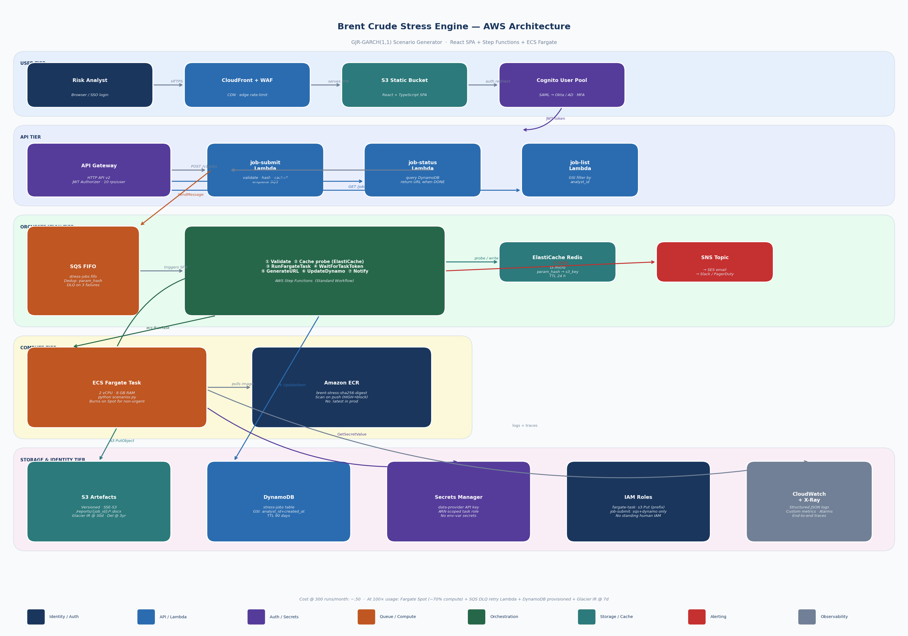

# AWS Deployment Design — Brent Crude Stress-Test Scenario Engine

## Architecture Diagram



---

## How a risk analyst invokes this on demand

A risk analyst opens an internal web portal authenticated via corporate SSO.
They select a named scenario preset (e.g. "Russia-Ukraine Supply Shock") or
build a custom run: calibration window, number of paths, projection horizon, tail
override, and seed. They click **Run Scenario**. The UI shows a live progress bar
backed by job-status polling. Within two to five minutes a **Download Report**
button appears. One click fetches a time-limited pre-signed S3 URL for
`scenario_analysis.docx` (or `report.html`). No CLI access, no AWS Console, no
infrastructure knowledge required.

---

## Architecture — ASCII reference

```
┌─────────────────────────────────────────────────────────────────────────────┐
│  RISK ANALYST BROWSER                                                        │
│  ┌──────────────────────────────────────────────────────────────────────┐   │
│  │  React / TypeScript SPA                                               │   │
│  │  • Scenario builder form    • Live job progress bar                   │   │
│  │  • Job history table        • Report download / inline viewer         │   │
│  └────────────────────────┬─────────────────────────────────────────────┘   │
└───────────────────────────│─────────────────────────────────────────────────┘
                            │ HTTPS
                            │ Cognito JWT (from SSO federation)
═══════════════════════════ AWS CLOUD ════════════════════════════════════════════

┌─────────────────────────── PRESENTATION TIER ──────────────────────────────┐
│                                                                              │
│  ┌──────────────────┐   serves    ┌──────────────────┐                      │
│  │  CloudFront      │────────────►│  S3 (frontend)   │                      │
│  │  CDN + WAF       │             │  React SPA bundle │                      │
│  │  (OAC policy)    │             │  + scenario presets JSON                 │
│  └──────────────────┘             └──────────────────┘                      │
│                                                                              │
│  ┌──────────────────────────────────────────────────────────────────────┐   │
│  │  Amazon Cognito User Pool                                             │   │
│  │  SAML 2.0 federation → Corporate Active Directory / Okta              │   │
│  │  JWT tokens (access + ID)   ·   MFA enforced for risk users           │   │
│  └──────────────────────────────────────────────────────────────────────┘   │
└──────────────────────────────────────────────────────────────────────────────┘

┌─────────────────────────── API TIER ───────────────────────────────────────┐
│                                                                              │
│  ┌──────────────────────────────────────────────────────────────────────┐   │
│  │  API Gateway  (HTTP API v2)                                           │   │
│  │  JWT Authorizer (Cognito)  ·  Throttle: 10 rps per user              │   │
│  │                                                                        │   │
│  │   POST  /v1/jobs            → Lambda: job-submit                      │   │
│  │   GET   /v1/jobs/{job_id}   → Lambda: job-status                      │   │
│  │   GET   /v1/jobs            → Lambda: job-list  (analyst's history)   │   │
│  └──────────────────────────────────────────────────────────────────────┘   │
│                                                                              │
│  ┌──────────────┐  ┌──────────────────┐  ┌───────────────────────────┐     │
│  │ job-submit   │  │ job-status       │  │ job-list                  │     │
│  │ Lambda 256 MB│  │ Lambda 128 MB    │  │ Lambda 128 MB             │     │
│  │ · validate   │  │ · query DynamoDB │  │ · DynamoDB GSI by user    │     │
│  │ · hash params│  │ · return status, │  │ · return last 30 jobs     │     │
│  │ · cache hit? │  │   pre-signed URL │  │   with status + links     │     │
│  │ · enqueue SQS│  │   when COMPLETE  │  └───────────────────────────┘     │
│  └──────┬───────┘  └──────────────────┘                                    │
└─────────│────────────────────────────────────────────────────────────────────┘
          │ SendMessage
          ▼
┌─────────────────────────── QUEUE TIER ─────────────────────────────────────┐
│                                                                              │
│  ┌──────────────────────────────────────────────────────────────────────┐   │
│  │  SQS FIFO Queue  — stress-jobs.fifo                                   │   │
│  │  MessageGroupId = param_hash  (same run never executes twice in      │   │
│  │  parallel)  ·  DeduplicationId = job_id  ·  Visibility = 15 min      │   │
│  │  Dead-Letter Queue (DLQ): 3 receive attempts before parking           │   │
│  └──────────────────────────────────┬───────────────────────────────────┘   │
└─────────────────────────────────────│──────────────────────────────────────┘
                                      │ triggers
                                      ▼
┌─────────────────────────── ORCHESTRATION TIER ──────────────────────────────┐
│                                                                              │
│  ┌──────────────────────────────────────────────────────────────────────┐   │
│  │  AWS Step Functions  (Standard Workflow)                              │   │
│  │                                                                        │   │
│  │   ① ValidateJob      — re-check params, enforce quotas per user       │   │
│  │   ② CacheProbe       — ElastiCache Redis: param_hash → S3 key?        │   │
│  │         ├─ HIT  → skip to ⑤ GenerateURL                              │   │
│  │         └─ MISS → ③                                                   │   │
│  │   ③ RunFargateTask   — ecs:RunTask (Fargate SPOT if flagged)          │   │
│  │   ④ WaitForTask      — .waitForTaskToken  (poll every 30 s via        │   │
│  │                         EventBridge Pipe → Lambda heartbeat)           │   │
│  │   ⑤ GenerateURL      — Lambda: s3:GetObject pre-signed (4 hr TTL)     │   │
│  │   ⑥ UpdateDynamoDB   — write COMPLETE status + S3 key + URL           │   │
│  │   ⑦ NotifyAnalyst    — SNS → SES email / Slack webhook                │   │
│  │         ╰─ on FAIL → DLQ alert + PagerDuty via SNS                    │   │
│  └──────────────────────────────────────────────────────────────────────┘   │
└──────────────────────────────────────────────────────────────────────────────┘

┌─────────────────────────── COMPUTE TIER ───────────────────────────────────┐
│                                                                              │
│  ┌──────────────────────────────────────────────────────────────────────┐   │
│  │  ECS Fargate Task  (brent-stress:latest, pulled from ECR)             │   │
│  │  2 vCPU · 8 GB RAM  (right-sized for 1 000-path GJR-GARCH run)       │   │
│  │                                                                        │   │
│  │  Entrypoint:  python scenarios.py --n-paths $N_PATHS                  │   │
│  │               --horizon $HORIZON --seed $SEED                         │   │
│  │                                                                        │   │
│  │  On completion:                                                        │   │
│  │    aws s3 cp reports/scenario_analysis.docx s3://artefacts/…          │   │
│  │    aws s3 cp reports/report.html            s3://artefacts/…          │   │
│  │  Sends Step Functions task heartbeat → triggers ⑤ GenerateURL        │   │
│  └──────────────────────────────────────────────────────────────────────┘   │
│                                                                              │
│  ┌──────────────────────────────────────────────────────────────────────┐   │
│  │  Amazon ECR  — container registry                                     │   │
│  │  Image tag: sha256 digest pinned (no :latest drift in production)     │   │
│  │  Scan on push (ECR basic scanning, flag HIGH/CRITICAL CVEs)           │   │
│  └──────────────────────────────────────────────────────────────────────┘   │
└──────────────────────────────────────────────────────────────────────────────┘

┌─────────────────────────── STORAGE TIER ───────────────────────────────────┐
│                                                                              │
│  ┌───────────────────────────────┐  ┌──────────────────────────────────┐   │
│  │  S3  — brent-stress-artefacts │  │  DynamoDB  — stress-jobs         │   │
│  │  Versioned · Private · SSE-S3 │  │  PK: job_id (UUID)               │   │
│  │                                │  │  GSI: analyst_id + created_at    │   │
│  │  /reports/{job_id}/            │  │  Attrs: status, params_hash,     │   │
│  │    scenario_analysis.docx      │  │    s3_key, url_expires_at,       │   │
│  │    report.html                 │  │    n_pass, duration_s            │   │
│  │  /models/{job_id}/params.json  │  │  TTL: created_at + 90 days       │   │
│  │                                │  └──────────────────────────────────┘   │
│  │  Lifecycle:                    │                                          │
│  │    30 d → S3 Glacier IR        │  ┌──────────────────────────────────┐   │
│  │    365 d → Glacier Deep        │  │  ElastiCache Redis  (t3.micro)   │   │
│  │    1095 d → Delete             │  │  Cache key: sha256(params_json)  │   │
│  └───────────────────────────────┘  │  Value: s3_key  TTL: 24 h         │   │
│                                      │  Prevents redundant Fargate runs  │   │
│                                      └──────────────────────────────────┘   │
└──────────────────────────────────────────────────────────────────────────────┘

┌─────────────────────────── IDENTITY & SECRETS ─────────────────────────────┐
│                                                                              │
│  ┌──────────────────────────────────────────────────────────────────────┐   │
│  │  IAM — Least-privilege roles, no standing human IAM users            │   │
│  │                                                                        │   │
│  │  fargate-task-role:                                                    │   │
│  │    s3:PutObject      arn:…:brent-stress-artefacts/reports/*           │   │
│  │    s3:PutObject      arn:…:brent-stress-artefacts/models/*            │   │
│  │    secretsmanager:GetSecretValue  arn:…:brent-stress/yfinance-key     │   │
│  │    states:SendTaskSuccess / SendTaskFailure  (heartbeat to SFN)       │   │
│  │                                                                        │   │
│  │  job-submit-lambda-role:                                               │   │
│  │    sqs:SendMessage   arn:…:stress-jobs.fifo                           │   │
│  │    dynamodb:PutItem  arn:…:stress-jobs                                │   │
│  │    elasticache:*     (cluster endpoint, VPC-scoped)                   │   │
│  │                                                                        │   │
│  │  Analysts: Cognito JWT → API Gateway → no direct AWS access            │   │
│  │  Secrets Manager: premium data-provider API key (if added later)      │   │
│  │  No secrets in env vars, Dockerfile, or source code                   │   │
│  └──────────────────────────────────────────────────────────────────────┘   │
└──────────────────────────────────────────────────────────────────────────────┘

┌─────────────────────────── OBSERVABILITY ──────────────────────────────────┐
│                                                                              │
│  Structured JSON log emitted by every Fargate run:                          │
│  { "job_id":"…", "scenario":"S03", "n_paths":1000, "duration_s":142,       │
│    "n_pass":5, "persistence":0.978, "var99":6.58, "es99":9.1 }             │
│                                                                              │
│  ┌──────────────────────────────────────────────────────────────────────┐   │
│  │  CloudWatch Logs → Log Insights saved queries:                        │   │
│  │    · P50 / P99 run duration per scenario                              │   │
│  │    · FAIL rate (n_pass < 6) over trailing 7 days                      │   │
│  │    · Error count by Lambda function                                    │   │
│  └──────────────────────────────────────────────────────────────────────┘   │
│                                                                              │
│  ┌──────────────────────────────────────────────────────────────────────┐   │
│  │  CloudWatch Dashboard  — "StressEngine-Ops"                           │   │
│  │    Run count · Median duration · PASS rate · DLQ depth · Cache hit % │   │
│  └──────────────────────────────────────────────────────────────────────┘   │
│                                                                              │
│  ┌──────────────────────────────────────────────────────────────────────┐   │
│  │  CloudWatch Alarms → SNS Topic → Slack + PagerDuty                   │   │
│  │    · DLQ depth > 0             (any run failure)                      │   │
│  │    · P99 Fargate duration > 10 min                                    │   │
│  │    · Lambda error rate > 2 %   (5-min window)                         │   │
│  │    · n_pass < 5 on any run     (model quality regression)             │   │
│  └──────────────────────────────────────────────────────────────────────┘   │
│                                                                              │
│  AWS X-Ray traces the full path:                                            │
│    Browser → API GW → Lambda → SFN → Fargate → S3 put                      │
│  Trace map surfaces latency hotspots (e.g. yfinance fetch vs GARCH fit)    │
└──────────────────────────────────────────────────────────────────────────────┘
```

---

## Invocation path — step by step

```
1.  Analyst opens  https://stress.internal.company.com  (CloudFront → S3 SPA)
2.  Cognito SSO redirect → corporate Okta → returns JWT (15-min access token)
3.  SPA sends:  POST /v1/jobs  {scenario:"S03", n_paths:1000, horizon:126, seed:42}
4.  API Gateway validates JWT → routes to  job-submit  Lambda
5.  Lambda computes param_hash = sha256(payload_json)
6.  Lambda checks ElastiCache: param_hash → cache HIT? → return existing s3_key instantly
7.  Cache MISS → Lambda writes job record to DynamoDB (status: QUEUED)
                → SendMessage to SQS FIFO (MessageGroupId = param_hash)
8.  SQS triggers Step Functions execution (Lambda event source mapping)
9.  Step Functions:
       ① Validate  → enforce max n_paths 5 000 per run
       ②  (CacheProbe second-check, race-condition guard)
       ③ ecs:RunTask → Fargate task (2 vCPU, 8 GB) in private subnet, no public IP
       ④ .waitForTaskToken  (heartbeat every 60 s from Fargate via SFN SDK)
10. Fargate runs:  python scenarios.py --n-paths 1000 --horizon 126 --seed 42
       → writes  reports/scenario_analysis.docx  +  reports/report.html
       → s3:PutObject  s3://brent-stress-artefacts/reports/{job_id}/…
       → states:SendTaskSuccess (task token in env var)
11. Step Functions resumes:
       ⑤ Lambda generates pre-signed GET URL (TTL 4 h)
       ⑥ DynamoDB UpdateItem → status: COMPLETE, s3_key, url_expires_at
       ⑦ SNS → SES email to analyst: "Your report is ready — [Download]"
12. Meanwhile SPA polling  GET /v1/jobs/{job_id}  every 10 s:
       → status transitions QUEUED → RUNNING → COMPLETE
       → SPA renders  Download DOCX  button with pre-signed URL
13. Analyst clicks. CloudFront serves the pre-signed S3 object directly.
    No server involved in the download. Presigned signature expires in 4 hours.
```

---

## Service justifications

| Service | Role | Why this service, not an alternative |
|---|---|---|
| **CloudFront + WAF** | CDN for SPA; edge-layer defence | Global PoPs for low latency; WAF blocks SQL-injection, enforces rate limits at the edge before any Lambda invocation cost is incurred. ALB + EC2 would add idle cost and ops burden for a mostly-static frontend. |
| **S3 (frontend bucket)** | Static SPA hosting | Serverless, infinitely scalable, $0.023/GB/month. No server to patch. OAC policy ensures CloudFront is the only allowed origin. |
| **Amazon Cognito** | AuthN + SAML federation | Native integration with API Gateway JWT authorizer; SAML 2.0 to Okta/ADFS means no separate password store; MFA enforced by corporate IdP. Not Keycloak: avoids self-hosting an IdP. |
| **API Gateway (HTTP API v2)** | REST surface | HTTP API is 70 % cheaper than REST API and supports JWT authorizers natively. Throttle per user (10 rps) prevents runaway job submissions without a custom rate-limiter. |
| **Lambda (x3)** | Stateless API handlers | $0/idle; cold-start under 200 ms for these small functions. Not ECS: over-engineered for sub-second, low-compute API glue. |
| **SQS FIFO** | Job queue + dedup | FIFO deduplication by `param_hash` prevents identical runs executing in parallel (same analyst submitting twice). MessageGroupId isolates per-run sequencing. DLQ surfaces failures without silent drops. |
| **Step Functions (Standard)** | Orchestration | Natively integrates `.waitForTaskToken` for long-running Fargate jobs without polling Lambda loops. Full execution history stored 90 days for audit. Not EventBridge Pipes alone: insufficient for branching (cache hit → skip compute). |
| **ECS Fargate** | Model compute | 2 vCPU / 8 GB right-sized for 1 000-path GJR-GARCH + docx generation (~3 min). No EC2 instances to manage or pay for at idle. Fargate Spot available for non-urgent analyst-hours runs. |
| **ECR** | Container registry | Image pulled by digest (SHA256) — deterministic, no tag-drift. ECR scanning flags HIGH/CRITICAL CVEs on push; blocks promotion if threshold exceeded. |
| **ElastiCache Redis (t3.micro)** | Result cache | Identical param sets (e.g. the same baseline scenario run twice in a day) return instantly without re-invoking Fargate. Cache key = `sha256(scenario_params)`. TTL 24 h matches typical analyst re-run cadence. |
| **S3 (artefacts, versioned)** | Durable report storage | Versioned bucket preserves overwritten objects; audit trail of every report ever produced. Lifecycle policy: Glacier IR at 30 d (cold audit), Glacier Deep Archive at 365 d, delete at 3 years. |
| **DynamoDB (on-demand)** | Job metadata | TTL auto-deletes stale records. GSI on `(analyst_id, created_at)` for efficient job-history queries. On-demand billing: $0/idle, no table provisioning required. |
| **Secrets Manager** | API keys | Premium data-provider key (if yfinance replaced) stored here; IAM task role scoped to specific secret ARN. Rotation supported natively. No secrets in env vars or Dockerfile. |
| **CloudWatch Logs + Insights** | Log aggregation | Structured JSON logs queryable with Log Insights — P99 duration, FAIL rate, per-scenario breakdown without a separate log stack. Not OpenSearch: unnecessary for this volume. |
| **X-Ray** | Distributed tracing | Traces the full invocation chain; identifies whether latency is in yfinance data fetch, GARCH fit, or docx generation. Integrated with Lambda and Fargate with one SDK call. |
| **SNS + SES** | Analyst notification | Email "report ready" on COMPLETE; PagerDuty integration on DLQ depth > 0. SNS fan-out means adding Slack/Teams webhook is one new subscription, no code change. |

---

## Identity and secrets

Access is stratified across three principals with no overlap:

**Risk analysts** authenticate exclusively via Cognito (SAML → Okta). They receive a short-lived JWT that API Gateway validates. They never hold IAM credentials and cannot call AWS APIs directly. The Cognito token encodes group membership (`risk-analysts`) which API Gateway propagates to Lambda for per-user quota enforcement.

**Lambda functions** each carry a minimal execution role. `job-submit` can write to SQS and DynamoDB only. `job-status` can read DynamoDB only. No function has `s3:*` or `ecs:*`. Roles are generated by CDK with explicit `Deny` on `iam:*` to prevent privilege escalation.

**Fargate tasks** carry a task role — distinct from the task execution role (which only pulls the ECR image). The task role has `s3:PutObject` scoped to `arn:aws:s3:::brent-stress-artefacts/reports/*` and `s3:PutObject` to `…/models/*`, nothing else. It reads the data-provider key from Secrets Manager via a single `secretsmanager:GetSecretValue` on the exact secret ARN. `states:SendTaskSuccess/Failure` allows the heartbeat back to Step Functions.

No credentials live in the container image, environment variables, or source code. The ECR image is scanned on push; a GitHub Actions workflow blocks merge if HIGH CVEs are detected.

---

## Observability

Every Fargate run emits a single structured JSON summary to CloudWatch Logs on completion:

```json
{
  "job_id": "3f8a12b4-…",
  "scenario": "S03",
  "analyst_id": "p.tiwari@company.com",
  "n_paths": 1000,
  "horizon": 126,
  "seed": 42,
  "duration_s": 142,
  "n_pass": 5,
  "n_total": 6,
  "var99_daily": 8.31,
  "es99_daily": 11.2,
  "persistence": 0.978,
  "yfinance_fetch_s": 3.1,
  "garch_fit_s": 18.4,
  "simulate_s": 96.2,
  "docx_write_s": 8.7
}
```

Four CloudWatch Log Insights saved queries run on a scheduled basis:
- P50/P99 run duration per scenario (trend over 30 days)
- FAIL rate (`n_pass < n_total`) per week
- Error count by function name
- Cache hit rate (from `job-submit` logs)

The CloudWatch Dashboard **StressEngine-Ops** shows: daily run volume, median duration, PASS rate, DLQ depth, cache hit %, and Fargate task failures — one screen for the platform owner.

Four CloudWatch Alarms route to an SNS topic with two subscribers: Slack `#risk-platform-alerts` and PagerDuty (P2 priority):
- DLQ depth > 0 (any silently failed run)
- P99 Fargate duration > 10 min (regression in compute performance)
- Lambda error rate > 2 % over 5-minute window
- `n_pass < 5` on any run (model quality degradation)

X-Ray traces every request end-to-end. The service map shows API Gateway → Lambda → SFN → Fargate → S3. Segment-level timing pinpoints whether latency is in the yfinance fetch, GARCH estimation, or report generation — actionable without log-trawling.

---

## Cost estimate — ~10 runs/day (300 runs/month)

| Resource | Specification | Monthly cost |
|---|---|---|
| CloudFront | 1 GB egress/month (report downloads) | ~$0.09 |
| S3 frontend | 10 MB SPA bundle | ~$0.01 |
| Cognito | < 50 000 MAU (free tier) | $0.00 |
| API Gateway (HTTP) | 10 000 requests/month | ~$0.01 |
| Lambda | 1 000 invocations, 256 MB, < 1 s each | $0.00 (free tier) |
| SQS FIFO | 1 000 messages/month | $0.00 (free tier) |
| Step Functions | 300 executions × 7 state transitions | ~$0.08 |
| ECS Fargate | 0.25 vCPU + 1 GB × 3 min × 300 runs | ~$1.20 |
| ECR | 1 GB image storage | ~$0.10 |
| ElastiCache Redis | t3.micro, 24/7 | ~$15.00 |
| S3 artefacts | 50 MB × 300 reports = 15 GB | ~$0.35 |
| DynamoDB | On-demand, < 1 M reads/writes | ~$0.25 |
| Secrets Manager | 1 secret | ~$0.40 |
| CloudWatch | Logs + Metrics + Dashboard | ~$2.00 |
| X-Ray | 300 traces | ~$0.01 |
| **Total** | | **~$19.50/month** |

> **Note:** ElastiCache dominates the bill at 77 % of total cost. At fewer than 20 runs/day it can be replaced with a DynamoDB-backed cache (param_hash → s3_key item, TTL 24 h) for <$0.05/month, eliminating ElastiCache entirely until usage justifies it.

---

## At one hundred times the usage (~1 000 runs/day)

At 30 000 runs per month the architecture requires three structural changes. First, **compute concurrency**: SQS triggers Fargate tasks via ECS capacity provider auto-scaling (target 20 concurrent tasks); Fargate Spot replaces on-demand for analyst-submitted runs during business hours — a 70 % compute cost reduction at the price of occasional 2-minute delays when Spot capacity is reclaimed, acceptable for a non-latency-critical analytical workload. Second, **cache effectiveness becomes critical**: ElastiCache is upgraded from t3.micro to r6g.large (in-memory throughput scales with concurrent Lambda reads); the cache hit rate is the single largest cost lever — if 40 % of runs are duplicates (same scenario, same seed re-run by a second analyst), Fargate invocations drop from 30 000 to 18 000, cutting the compute bill nearly in half. Third, **queue and state management**: SQS visibility timeout is tuned to match P99 Fargate task duration (8 minutes); the DLQ gets a Lambda consumer that pages on-call and auto-retries transient failures (yfinance outage, ECR pull failure) with exponential back-off; DynamoDB switches to provisioned capacity with auto-scaling on the GSI to avoid throttling during batch submission windows (e.g. end-of-day scenario refresh); S3 lifecycle policy transitions reports to Glacier Instant Retrieval at 7 days rather than 30 to control the storage bill, which grows to ~450 GB/month at 15 MB per report.